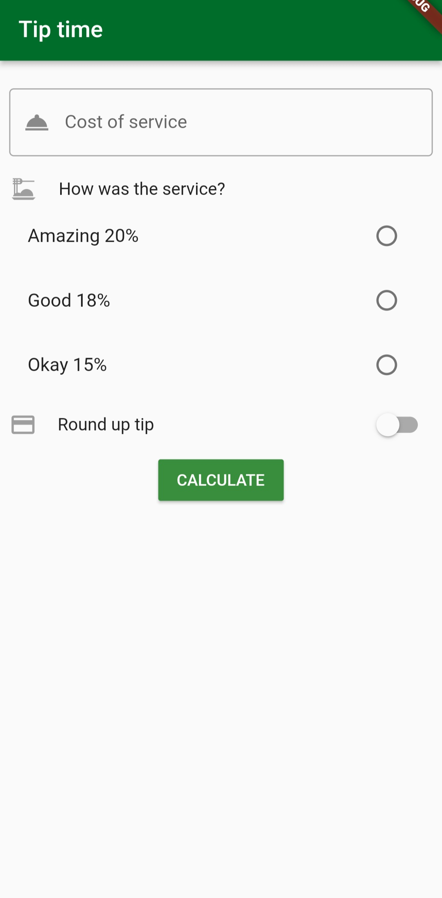

# App Tip Time

## Descripción

App Tip Time es una aplicación diseñada siguiendo los lineamientos de Material Design. Su objetivo principal es permitir al usuario calcular la propina de manera interactiva. La aplicación aprovecha eficientemente el espacio en pantalla y ofrece una experiencia de usuario intuitiva.

## Temas Abordados

- Uso de widgets Radio y Switch
- Interacción del usuario con controles de formulario
- Implementación de cambios de estado utilizando Provider
- Formateo de cadenas de texto
- Uso de Text Fields
- Radio group
- Utilización de la paleta de colores primarios

## Lo que me costó más trabajo

- Implementar el cambio de estado del Switch utilizando Provider.
- Lograr que los estilos de los widgets coincidieran exactamente con la pantalla principal de la aplicación.
- Inicialmente, intenté implementar la aplicación usando un enfoque Stateful y luego tuve que migrarla a Provider.

## Lo que aprendí

Durante el desarrollo de App Tip Time, aprendí:

- El uso efectivo del widget Switch para capturar la entrada del usuario.
- Cómo trabajar con Radio Buttons para obtener selecciones del usuario.
- La implementación de Provider para gestionar el estado de la aplicación.

## Capturas de Pantalla

A continuación, se presentan algunas capturas de pantalla de la aplicación:

# tip_time

A new Flutter project.

## Getting Started

This project is a starting point for a Flutter application.

A few resources to get you started if this is your first Flutter project:

- [Lab: Write your first Flutter app](https://docs.flutter.dev/get-started/codelab)
- [Cookbook: Useful Flutter samples](https://docs.flutter.dev/cookbook)

For help getting started with Flutter development, view the
[online documentation](https://docs.flutter.dev/), which offers tutorials,
samples, guidance on mobile development, and a full API reference.
